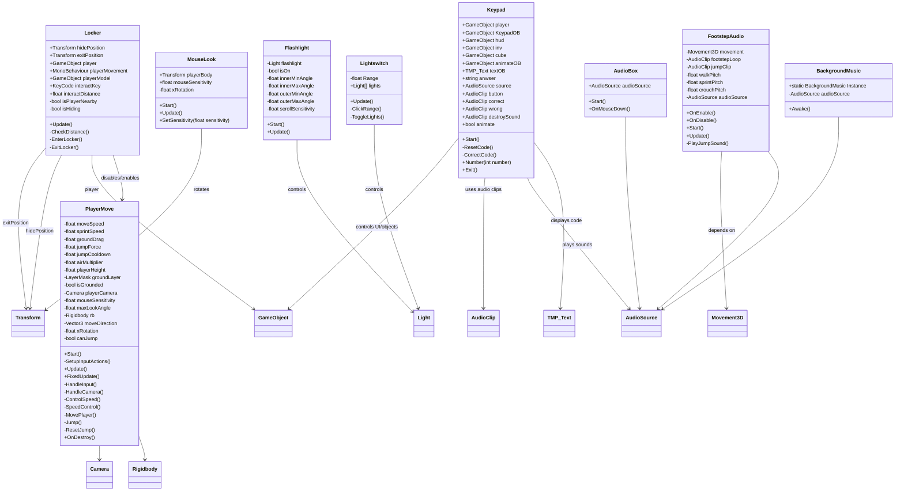

# horror game periode 4

Below is a **GitHub-optimized README-ready version** with proper heading hierarchy, consistent Markdown structure, and scannable sections suitable for contributors.

---

# Definition of Done (DoD)

This document defines the minimum quality standards required before any feature, gameplay system, script, prefab, or interaction can be considered complete and ready for merge.

A task is only considered **Done** when all applicable requirements below are satisfied.

---

# Core Quality Requirements

All systems and features must meet the following standards:

## Stability

* No compiler errors
* No compiler warnings
* No runtime exceptions
* No `NullReferenceException`
* No broken references in scenes or prefabs
* No softlocks or unrecoverable gameplay states

---

## Functionality

* Feature works as intended in all expected gameplay scenarios
* Feature can be repeatedly tested without breaking
* Interactions are responsive and consistent
* Systems recover correctly from state changes
* Toggleable systems return to valid states reliably

---

## Bug-Free Requirement

Before merging:

* Feature must be tested in Play Mode
* No known critical bugs may remain
* No inconsistent behavior between sessions
* Physics behavior must remain stable and reproducible
* Edge cases must be tested where applicable

Examples:

* No player clipping
* No duplicate audio playback
* No stuck movement states
* No interaction spam exploits
* No broken camera states

---

# Architecture Standards

## Component-Based Design

Scripts must follow Unity component architecture principles:

* Single responsibility per script
* Avoid large “god scripts”
* Reusable systems preferred over hardcoded logic
* Prefab-driven workflows encouraged

---

## Input System Rules

Input systems must never be mixed on the same player object.

### Approved Separation

| System       | Input Type       |
| ------------ | ---------------- |
| `PlayerMove` | New Input System |
| `Movement3D` | Old Input System |

---

## Physics Rules

* Rigidbody-based movement only
* No `transform.Translate()` movement for physics characters
* Physics handled in `FixedUpdate()`
* Input handled in `Update()`

---

## Audio Rules

* Looping sounds use `AudioSource.loop`
* One-shot sounds use `PlayClipAtPoint`
* Persistent music uses Singleton architecture
* No overlapping duplicate audio instances

---

## Interactable Rules

All interactables must:

* Be distance-aware where appropriate
* Be null-safe
* Avoid hard scene references
* Support proper toggle/state handling
* Fail gracefully if references are missing

---

# Performance Requirements

Features must avoid unnecessary overhead.

## Requirements

* Avoid expensive operations inside `Update()`
* Cache references where possible
* Avoid repeated `GetComponent()` calls
* No excessive physics allocations
* No memory leaks from persistent objects

---

# Scene & Prefab Standards

## Scene Rules

* No missing references
* No unused GameObjects
* No duplicate manager systems
* Lighting and audio must initialize correctly

## Prefab Rules

* Reusable systems should use prefabs
* Prefabs must have valid references assigned
* Prefabs should not depend on scene-only objects unless documented

---

# Folder Structure Requirements

Scripts must follow project folder organization:

```text
Assets/Scripts/audio/
Assets/Scripts/camera/
Assets/Scripts/movement/
Assets/Scripts/interactables/
```

Additional assets:

```text
Assets/Sounds/
Assets/Prefabs/
Assets/Materials/
Assets/Scenes/
```

---

# Pull Request Requirements

Before merge:

* Feature branch created correctly
* Pull Request opened
* Build tested successfully
* No unfinished/WIP logic
* No debug spam left in production code
* README/documentation updated if feature changes architecture

---

# Testing Requirements

The following must be verified before approval:

* Gameplay flow works correctly
* Input behaves consistently
* Audio triggers correctly
* Camera behaves correctly
* Physics interactions are stable
* Scene transitions do not break systems

---

# Final Acceptance Criteria

A feature is considered complete only if:

* It is stable
* It is tested
* It is maintainable
* It follows architecture standards
* It introduces no regressions
* It can be merged without additional fixes required




## Gemaakt door

---

## Calvin

### Keypad System

* [keypad](https://github.com/charroo-van-megen/horror-game-periode-4/tree/main/Assets/Calvin)
  Handles keypad interactions and code validation. Plays button/correct/wrong sounds, updates UI text, unlocks objects after entering the correct code, and restores HUD/cursor states.

---

## Thomas

### Light Interaction Systems

* [LightSwitch](https://github.com/charroo-van-megen/horror-game-periode-4/blob/main/Assets/Scripts/Light%20switch.cs)
  Allows the player to toggle lights on and off using raycast-based interaction within a set range.

* [LightsOff](https://github.com/charroo-van-megen/horror-game-periode-4/blob/main/Assets/Scripts/Lights%20off.cs)
  Controls light shutdown behavior for environmental horror effects and scene atmosphere changes.

---

## Charroo

### Audio Systems

* [backgroundSound](https://github.com/charroo-van-megen/horror-game-periode-4/blob/main/Assets/Scripts/audio/Background%20music.cs)
  Persistent background music system using a Singleton pattern to prevent duplicate music across scenes.

* [PlayerSound](https://github.com/charroo-van-megen/horror-game-periode-4/blob/main/Assets/Scripts/audio/FootstepAudio.cs)
  Plays dynamic footstep and jump audio based on player movement, sprinting, crouching, and grounded state.

* [AudioBox](https://github.com/charroo-van-megen/horror-game-periode-4/blob/main/Assets/Scripts/audio/Soundbox.cs)
  Clickable audio object that toggles an `AudioSource` on and off when interacted with.

---

### Movement & Camera

* [movement](https://github.com/charroo-van-megen/horror-game-periode-4/blob/main/Assets/Scripts/Movement/PlayerMove.cs)
  Rigidbody-based first-person movement controller using the New Input System with sprinting, jumping, mouse look, and grounded movement handling.

* [Mouselook](https://github.com/charroo-van-megen/horror-game-periode-4/tree/main/Assets/Scripts/camera)
  Handles first-person camera rotation, vertical look clamping, mouse sensitivity settings, and cursor locking.

---

### Interaction Systems

* [Locker](https://github.com/charroo-van-megen/horror-game-periode-4/blob/main/Assets/Scripts/Locker.cs)
  Allows the player to hide inside lockers, disables movement while hidden, hides the player model, and restores the player state when exiting.

