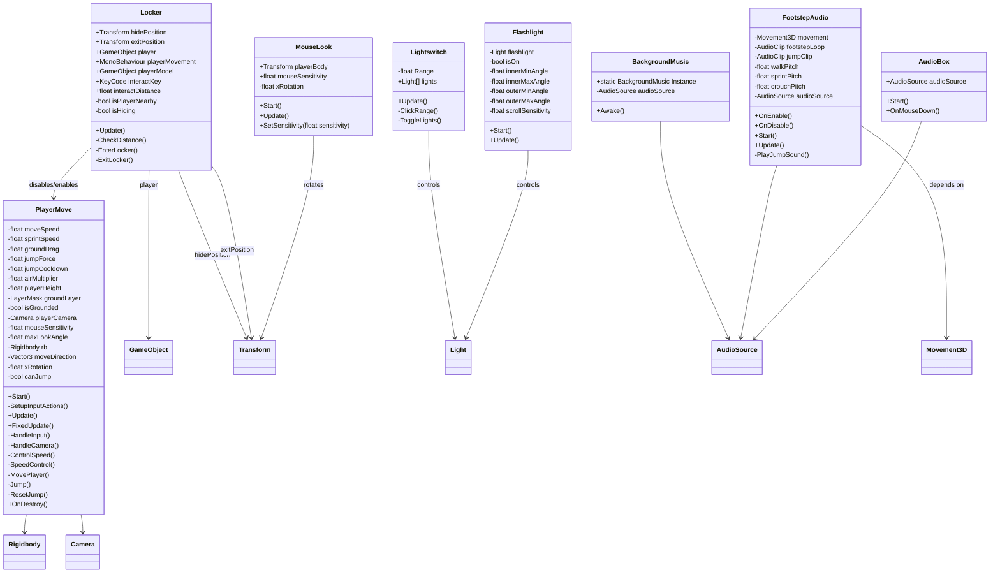

# horror game periode 4

Below is a **GitHub-optimized README-ready version** with proper heading hierarchy, consistent Markdown structure, and scannable sections suitable for contributors.

---

#  Definition of Done (DoD)

This document defines the minimum quality requirements for all features, scripts, and gameplay systems in this Unity project. A feature is only considered complete when all applicable criteria are met.

---

##  Branching & Workflow

###  Branch Rules

* Feature branches must follow naming convention:

  ```
  feature/<feature-name>
  ```
* All development must occur on feature branches

###  Pull Request Requirements

* Branch must be fully merged without conflicts
* A Pull Request (PR) must be created for review
* Build must be tested successfully before review
* PR must not contain unfinished (WIP) logic

---

##  Unity Project Structure

###  Folder Organization

Scripts must follow strict folder structure:

```
Assets/Scripts/audio/
Assets/Scripts/camera/
Assets/Scripts/movement/
Assets/Scripts/interactables/
```

###  Asset Rules

*  No scripts in root `Assets/Scripts/`
*  Audio files must be placed in:

  ```
  Assets/Sounds/
  ```
*  Prefabs must be used where appropriate (avoid scene-only logic)
*  No missing references in scenes

---

##  Code Quality Standards

###  General Rules

*  No compiler errors or warnings allowed
*  No runtime `NullReferenceException`
*  Code must follow component-based architecture
*  Avoid “god scripts” (single scripts handling too much logic)

###  Input System Rules

* Do not mix input systems on the same player:

  * `PlayerMove` → New Input System
  * `Movement3D` → Old Input System

###  Unity Update Rules

* `Update()` → Input & state handling only
* `FixedUpdate()` → Physics logic only

---

##  Gameplay Validation

###  General Gameplay Requirements

* Movement must feel responsive and consistent
* Audio feedback must match gameplay events
* No softlocks or broken interaction states
* Features must be toggleable without breaking scenes
* Physics must behave consistently across sessions

---

#  Script Definition of Done

---

##  BackgroundMusic.cs

###  Requirements

* Plays automatically on scene start
* Implements Singleton pattern (prevents duplicates)
* Persists across scenes (`DontDestroyOnLoad`)
* No overlapping audio on scene reload
* Uses valid `AudioSource` component

###  Acceptance Criteria

* Only one music track plays at all times
* No duplicate instances across scenes

---

##  FootstepAudio.cs

###  Requirements

* Only plays when:

  * Player is moving
  * Player is grounded
* Pitch system:

  * Crouch → lower pitch
  * Walk → default pitch
  * Sprint → higher pitch
* Jump sound triggered via `Movement3D.OnJump`
* Footstep loop starts/stops cleanly (no audio delay issues)

###  Acceptance Criteria

* No footsteps while idle
* No duplicate jump sounds

---

##  AudioBox.cs

###  Requirements

* Uses `OnMouseDown()` for interaction
* Toggles audio play/stop correctly
* Requires valid `AudioSource`
* Must be null-safe (no missing component crashes)

###  Acceptance Criteria

* Immediate response on click
* Toggle state remains consistent

---

##  MouseLook.cs

###  Requirements

* Smooth real-time mouse camera movement
* Vertical rotation clamped:

  ```
  -90° to +90°
  ```
* Horizontal rotation applied to player body
* Sensitivity saved using `PlayerPrefs`
* Cursor locked during gameplay

###  Acceptance Criteria

* No jitter or camera flipping
* No inverted or unstable controls

---

##  PlayerMove.cs (New Input System)

###  Requirements

* WASD movement via New Input System
* Jump with cooldown + grounded check
* Sprint increases movement speed
* Rigidbody-based movement (no transform movement)
* Gravity handled consistently
* Camera follows mouse delta input
* Escape key unlocks cursor

###  Acceptance Criteria

* No movement jitter
* No input delay or stuck states
* Stable Rigidbody physics behavior

---

##  Locker.cs

###  Requirements

* Player can interact within `interactDistance`
* `E` toggles enter/exit state
* Disables player movement while hidden
* Hides player model when inside locker
* Teleports player to correct hide/exit positions

###  Acceptance Criteria

* No clipping during transitions
* No stuck state inside locker
* Movement restores reliably

---

##  Movement3D.cs (Legacy Controller)

###  Requirements

* WASD movement via Old Input System
* Jump via `Input.GetButton("Jump")`
* Sprint and crouch states supported
* Ground check using Physics sphere
* Direct Rigidbody velocity control
* `OnJump` event is triggered correctly

###  Acceptance Criteria

* No ground sliding
* Jump is consistent and reproducible
* Crouch correctly modifies collider

---

#  Architecture Rules (Critical)

---

##  Input System Separation

* `PlayerMove` → New Input System
* `Movement3D` → Old Input System
*  Never enable both on the same player object

---

##  Audio Architecture Rules

* One-shot sounds → `PlayClipAtPoint`
* Looping sounds → `AudioSource.loop = true`
* Persistent music → Singleton (`BackgroundMusic`)

---

##  Movement Architecture Rules

* Rigidbody-based movement only
*  No mixing with `transform.Translate`
* Input handled in `Update()`
* Physics handled in `FixedUpdate()`

---

##  Interactable System Rules

All interactables must:

* Include distance-based interaction checks
* Support toggle state behavior
* Avoid hard scene references
* Be null-safe (defensive programming required)

---

If you want next-level GitHub integration, I can also generate:
* Issue templates for bugs / features
* A CI checklist for Unity builds (GitHub Actions-ready)


# Gemaakt door
Calvin 
[keypad](https://github.com/charroo-van-megen/horror-game-periode-4/tree/main/Assets/Calvin)

# Gemaakt Door
Thomas
[LightSwitch](https://github.com/charroo-van-megen/horror-game-periode-4/blob/main/Assets/Scripts/Light%20switch.cs)
[LightsOff](https://github.com/charroo-van-megen/horror-game-periode-4/blob/main/Assets/Scripts/Lights%20off.cs)

# Gemaakt Door
Charroo
[backgroundSound](https://github.com/charroo-van-megen/horror-game-periode-4/blob/main/Assets/Scripts/audio/Background%20music.cs)
[PlayerSound](https://github.com/charroo-van-megen/horror-game-periode-4/blob/main/Assets/Scripts/audio/FootstepAudio.cs)
[AudioBox](https://github.com/charroo-van-megen/horror-game-periode-4/blob/main/Assets/Scripts/audio/Soundbox.cs)
[movement](https://github.com/charroo-van-megen/horror-game-periode-4/blob/main/Assets/Scripts/Movement/PlayerMove.cs)
[Mouselook](https://github.com/charroo-van-megen/horror-game-periode-4/tree/main/Assets/Scripts/camera)
[Locker](https://github.com/charroo-van-megen/horror-game-periode-4/blob/main/Assets/Scripts/Locker.cs)
